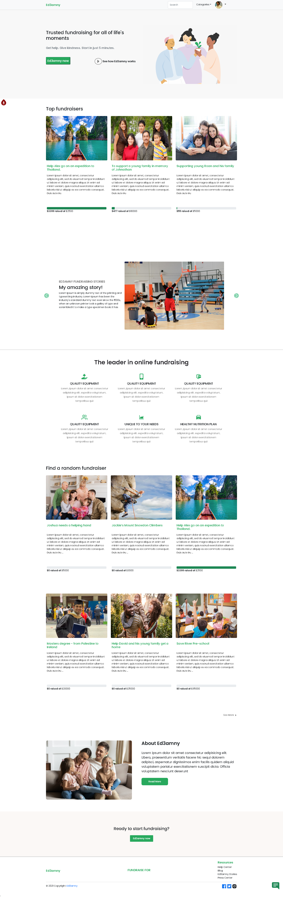
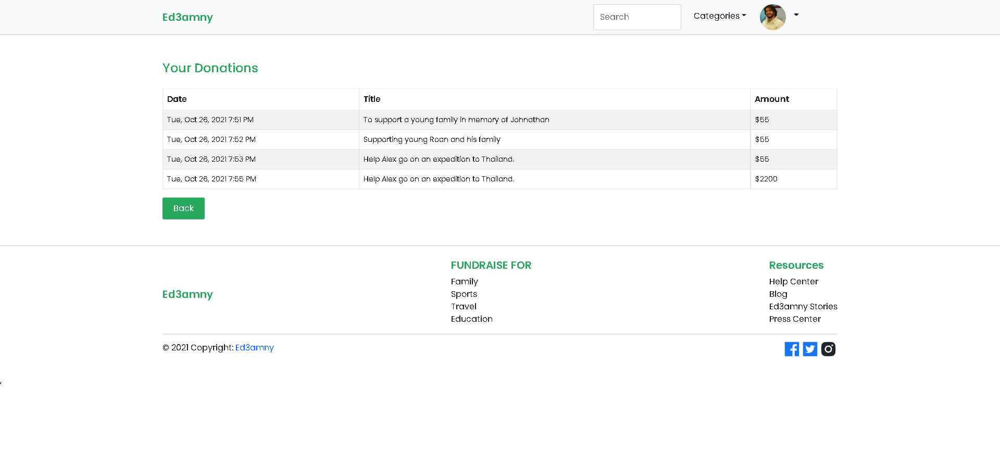
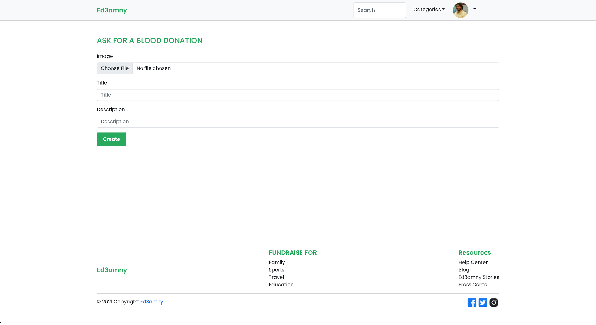
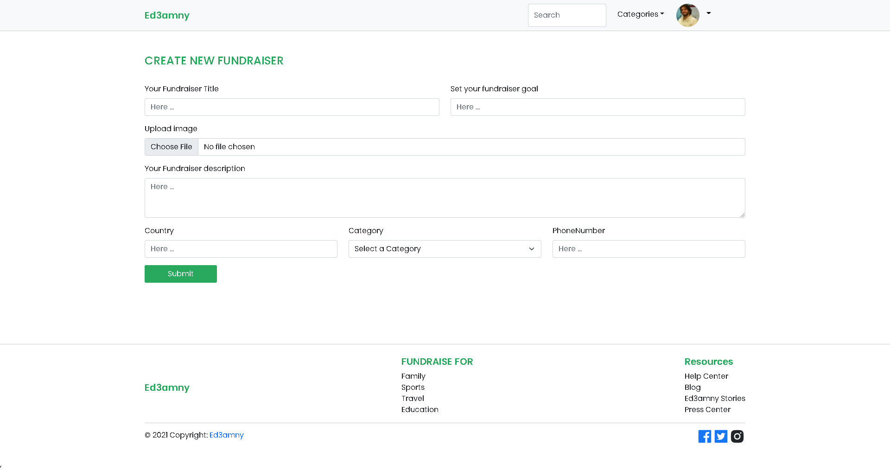

<div id="top"></div>

<!-- PROJECT LOGO -->
<br />
<div align="center">
  <h3 align="center">Ed3amny</h3>
  <a href="https://github.com/github_username/repo_name">
  </a>


  <p align="center">
    Developed in 2021, Ed3amny is a social fundraising platform. Its' mission is to help people fundraise for personal, business, and charitable causes.
    Note: Ed3amny is a clone of the massive Gofundme, we are students and we will NOT publish this website, it is simpley a project.
  </p>
</div>


<!-- TABLE OF CONTENTS -->
<details>
  <summary>Table of Contents</summary>
  <ol>
    <li>
      <a href="#about-the-project">About The Project</a>
      <ul>
        <li><a href="#built-with">Built With</a></li>
      </ul>
    </li>
    <li>
      <a href="#getting-started">Getting Started</a>
      <ul>
        <li><a href="#prerequisites">Prerequisites</a></li>
        <li><a href="#installation">Installation</a></li>
      </ul>
    </li>
    <li><a href="#usage">Usage</a></li>
    <li><a href="#roadmap">Roadmap</a></li>
    <li><a href="#contributing">Contributing</a></li>
    <li><a href="#license">License</a></li>
    <li><a href="#contact">Contact</a></li>
    <li><a href="#acknowledgments">Acknowledgments</a></li>
  </ol>
</details>


<!-- ABOUT THE PROJECT -->
## Images and links

(https://ed3amny.herokuapp.com/)
(https://imgur.com/a/9044ePL)








<p align="right">(<a href="#top">back to top</a>)</p>


### Built With


* [React.js](https://reactjs.org/)
* [React-Bootstrap](https://react-bootstrap.github.io/)
* [React-Redux](https://react-redux.js.org/)
* [Socket-io](https://socket.io/)
* [Microsoft Visual Studio Code](https://code.visualstudio.com/)
* [NodeJS](https://nodejs.org/en/)
* [Express](https://expressjs.com/)
* [MySQL](https://www.mysql.com/)
* [Stripe](https://stripe.com/en-gb-us)
* [Firebase](https://firebase.google.com/)
* [Heroku](https://dashboard.heroku.com/)
* [Socket-io](https://socket.io/)

<p align="right">(<a href="#top">back to top</a>)</p>

### The problem and the Solution

We live in a closed-minded society where asking for help is considered to be begging so that we have decided to develop Ed3amny to eliminate the fear of asking for help because everybody needs help. Ed3amny is here to help people in need, starter companies, students, families, the sick, and the poor.

## Usage

You can use this app to create fundraisers, set goals and share them on social media platforms to fulfill your dreams!

## Getting Started

The project was built using VS Code ver 1.60.1, ran and tested on Chrome Version 93.0.4577.82.
The project was built on Windows 10 64bit.
To get a local copy up and running follow these simple example steps.


### Prerequisites

There are no special prerequisites, I only need to note that you MAY need to manually install react-toastify package in the client/ path. 

Executing program

Open a terminal on the path ...\MERAKI_Academy_Project_5\
Open a terminal on the path ...\MERAKI_Academy_Project_5\client
Excecute the commands bellow and wait for the project to run...

npm run dev in the main folder.
npm start in the client folder.


### Installation

1. Clone the repo
   ```sh
   git clone https://github.com/C3-Polygon/MERAKI_Academy_Project_5.git
   ```
2. Install NPM packages
  
  Run NPM I in the terminal before you execute the run commands
  NPM i to install the required libraries in both the client and the server respected folders
  
  <p align="right">(<a href="#top">back to top</a>)</p>
 

<!-- ROADMAP -->
## Roadmap

- [Login] Feature 1
    - [Login with Facebook] 
- [Signup] Feature 2
- [Search] Feature 3
- [DropDown] Feature 4
    - [AccountSettings] 
       - [Edit user avatar] 
       - [Edit user firstName] 
       - [Edit user lastName] 
       - [Edit user age] 
       - [Edit user country] 
       - [Edit user phonenumber] 
    - [Donations You've Made] 
    - [View Your Fundraisers] 
       - [Manage Fundraiser] 
            - [Edit Title]      
            - [Edit Phone Number] 
            - [Edit Country] 
            - [Edit Goal] 
            - [Edit Photo] 
            - [Edit Story] 
            - [Delete Fundraiser] 
    - [Donations You've Made] 
    - [Start a Fundraiser] 
        - [Share Fundraiser on social media]
        - [Donate for a fundraiser via stripe] 
        - [View Donnors] 
    - [Ask for a Blood Donation] 
    - [Logout] 
- [Categories] Feature 5
    - [Education] 
    - [Family] 
    - [Sport] 
    - [Travel] 
    - [See All] 
- [How the website works(video)] Feature 6
- [View Top 3 Fundraisers] Feature 7
- [View Blood Posts] Feature 8
- [View Success Stories] Feature 9
- [View Random Fundraisers] Feature 10
- [Chat-Technical Support] Feature 11
- [View Success Stories] Feature 12

<!-- CONTRIBUTING -->
## Contributing

Contributions are what make the open source community such an amazing place to learn, inspire, and create. Any contributions you make are **greatly appreciated**.

If you have a suggestion that would make this better, please fork the repo and create a pull request. You can also simply open an issue with the tag "enhancement".
Don't forget to give the project a star! Thanks again!

1. Fork the Project
2. Create your Feature Branch (`git checkout -b feature/AmazingFeature`)
3. Commit your Changes (`git commit -m 'Add some AmazingFeature'`)
4. Push to the Branch (`git push origin feature/AmazingFeature`)
5. Open a Pull Request

<p align="right">(<a href="#top">back to top</a>)</p>


<!-- LICENSE -->
## License

Open Source.

<p align="right">(<a href="#top">back to top</a>)</p>


<!-- CONTACT -->
## Contact

* Ahmad Mraish        -   [https://github.com/AhmadMraish](https://github.com/AhmadMraish)
  - Email: ahmadmraish59@gmail.com
* Omar hushki         -   [https://github.com/hushki94](https://github.com/hushki94)
  - Email: Omarhushki94@gmail.com
* Maamoun Al-Ksiwani  -   [https://github.com/MaamounAksiwani](https://github.com/MaamounAksiwani)
  - Email: Omarhushki94@gmail.com
* Obada Amarneh       -   [https://github.com/ObadaAmarneh](https://github.com/ObadaAmarneh)
  - Email: obada.amarneh20@gmial.com

Project Link: [https://github.com/C3-Polygon/MERAKI_Academy_Project_5](https://github.com/C3-Polygon/MERAKI_Academy_Project_5)

<p align="right">(<a href="#top">back to top</a>)</p>


<!-- ACKNOWLEDGMENTS -->
## Acknowledgments

* [Ayman M.Hariri](https://github.com/engaymanh)
* [Batool Maali](https://github.com/batoolmaali)
* [Mai Al-Shagarin](https://github.com/maialshagarin)
* [Mohammed Farhan](https://github.com/Mohamad-Farhan)
* [Mohammad Jouza](https://github.com/MohammadJouza)
* [MERAKI_Academy](https://github.com/MERAKI-Academy)


<p align="right">(<a href="#top">back to top</a>)</p>


<!-- MARKDOWN LINKS & IMAGES -->
<!-- https://www.markdownguide.org/basic-syntax/#reference-style-links -->
[contributors-shield]: https://img.shields.io/github/contributors/github_username/repo_name.svg?style=for-the-badge
[contributors-url]: https://github.com/github_username/repo_name/graphs/contributors
[forks-shield]: https://img.shields.io/github/forks/github_username/repo_name.svg?style=for-the-badge
[forks-url]: https://github.com/github_username/repo_name/network/members
[stars-shield]: https://img.shields.io/github/stars/github_username/repo_name.svg?style=for-the-badge
[stars-url]: https://github.com/github_username/repo_name/stargazers
[issues-shield]: https://img.shields.io/github/issues/github_username/repo_name.svg?style=for-the-badge
[issues-url]: https://github.com/github_username/repo_name/issues
[license-shield]: https://img.shields.io/github/license/github_username/repo_name.svg?style=for-the-badge
[license-url]: https://github.com/github_username/repo_name/blob/master/LICENSE.txt
[linkedin-shield]: https://img.shields.io/badge/-LinkedIn-black.svg?style=for-the-badge&logo=linkedin&colorB=555
[linkedin-url]: https://linkedin.com/in/linkedin_username
[product-screenshot]: images/screenshot.png
